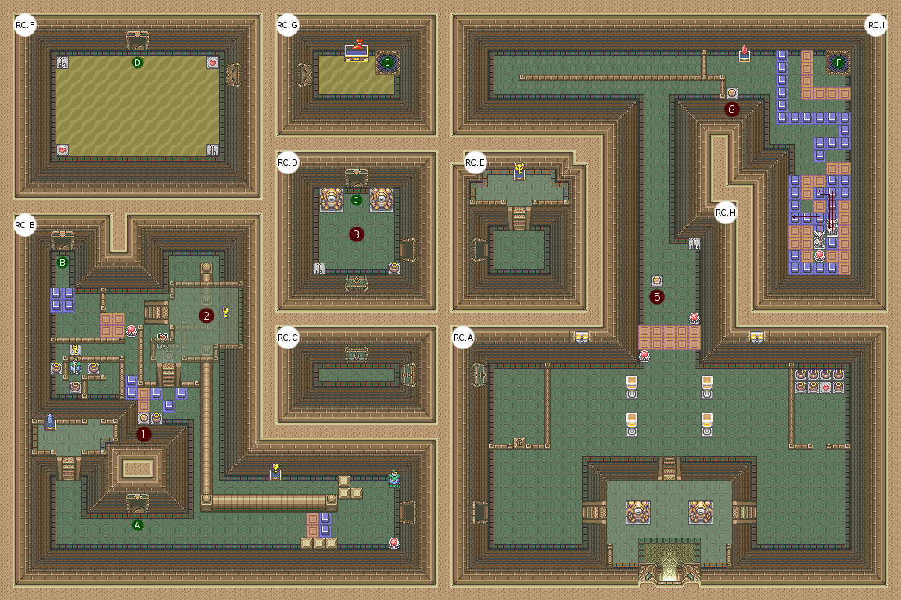
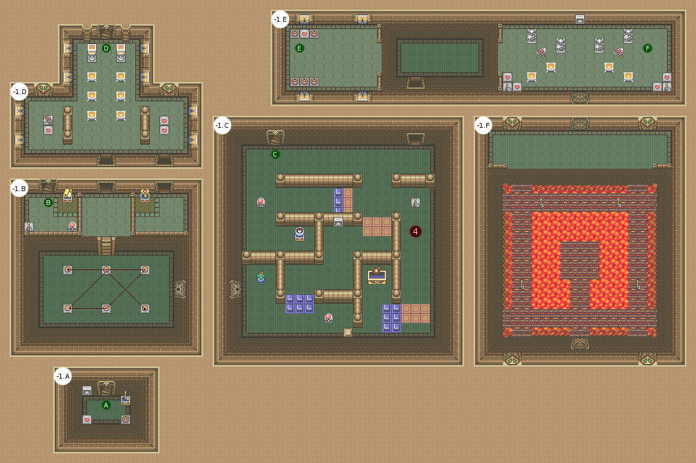
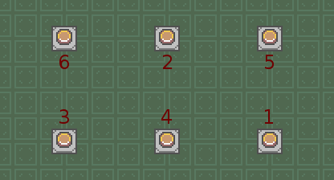

# Chapitre 4 : Caverne du Roc (Niveau 2)

## Cartes et informations utiles

| Etage | Carte |
|:--:|--|
| RDC |  |
| Sous-sol 1 |  |


| Salle | Ennemis |
|:-----:|:--------|
| RC.A | Popo (x6), Skeletor (x2), Globul (x1) |
| RC.B | Globul (x1), Skeletor (x1) |
| RC.C | Popo (x5) |
| RC.D | Skeletor (x1) |
| RC.F | Khotor (MINI-BOSS) |
| RC.H | Skeletor (x1), Globul (x1) |
| -1.B | Tetdoss (x1) |
| -1.C | Skeletor (x4) |
| -1.D | Skeletor (x1) |
| -1.E | Skeletor (x1) |
| -1.F | Phénix (BOSS) |


| N° | Evénements |
|:--:|:-----------|
| 1 | Ouvre la brèche à côté du coffre |
| 2 | Clé détenue par un Skeletor |
| 3 | Tirer dans l'oeil des statues (deux fois, une par porte) |
| 4 | Nécessite les Bottes de Pégase |
| 5 | Ouvre le muret au nord (chronométré, Bottes de Pégase requises) |
| 6 | Ouvre le muret au nord |

## Solution


Passez directement dans la salle de gauche une fois entré dans le donjon. Activez l'interrupteur de cristal, et grâce au Chou-Péteur, passez de l'autre côté des plots en l'envoyant depuis les plots bleus, puis montez dès que vous voyez un embranchement : l'entrée de l'escalier est bloquée par les plots bleus. Soulevez les deux vases, sous l'un d'eux se trouve un interrupteur qui ouvre le passage vers la suite. Rebroussez chemin jusqu'à l'embranchement, prenez l'escalier qui descend d'un étage, vous y trouverez un coffre ainsi qu'un indice. Ce coffre contient **5 flèches**, gardez-les précieusement si vous n'avez pas eu le temps d'en récupérer d'autres sur le chemin vers le donjon, vous en aurez besoin de 4 dans pas si longtemps. Remontez d'un étage, puis montez l'escalier sur la gauche. Un coffre contenant **5 rubis** s'y trouve. Sautez de la corniche que vous avez libéré grâce à l'interrupteur plus tôt, et suivez le seul passage possible.

Sous le Chou-Péteur se trouvera toujours une flèche, si vous en manquez vous savez où venir. Attention à bien lancer le Chou-Péteur au loin, ils explosent sur les murets. Le quatrième pot contient une **Petite Clé**. Activez l'interrupteur de cristal pour faire descendre les plots bleus, puis au choix utilisez soit le Chou-Péteur, soit une flèche pour refaire monter les plots bleus alors que vous êtes dessus. Puis envoyez une flèche et allez vite sur la droite dès que la flèche est tirée pour vous retrouver sur les plots oranges tant qu'ils sont baissés : ils vont remonter dans le même temps, libérant l'accès à l'escalier. Le Skeletor sur la plateforme supérieure possède une **Petite Clé**. Redescendez de cette plateforme et allez à l'escalier en haut à gauche de la salle (il faut pour cela activer l'interrupteur depuis les plots oranges, et pour revenir il vous faudra une flèche). Il vous mènera dans une petite salle avec la **Carte** du donjon.

Rebroussez chemin et passez sous la plateforme où se trouve le Skeletor. Comme vous pouvez le constater sur la carte, vous pouvez accéder au **Fragment de Cœur #05** en faisant le tour par le bas et en soulevant un pot (guettez le bouton Action pour voir quand il passe en "Soulever"), puis redescendez en longeant le mur de droite. Vous arrivez à un coffre contenant une troisième **Petite Clé**. En poussant les blocs (celui du haut vers la droite, celui de gauche vers le bas et celui de droite vers la droite) vous pouvez retourner à l'entrée. Vous allez utiliser vos trois clés d'un seul coup : allez de suite vers le haut et enlevez le bloc verrouillé, passez la porte verrouillée (vers l'ouest), et encore la seconde porte verrouillée (vers le nord). Dans la salle suivante, vous avez deux statues cyclopes. Décochez deux flèches dans chacune en alternant obligatoirement entre la statue de droite et celle de gauche pour faire apparaître un escalier vers le nord puis une porte dérobée sur l'est. Passez d'abord vers l'est : vous récupérez la **Grande Clé** du donjon. Descendez ensuite l'escalier découvert quelques secondes avant.



Vous êtes désormais dans une très grande salle. Allez dans un premier temps directement vers le sud pour récupérer la **Boussole** dans un coffre, puis placez-vous à l'intersection suivante à côté de la jarre, derrière les deux rangées de plot de couleur différentes. Les plots oranges doivent être baissés. Décochez une flèche et descendez immédiatement : les plots oranges se relèvent alors que vous êtes dessus. Vous pouvez désormais passer dans la salle suivante grâce à la Grande Clé. Dans cette salle, suivez les chiffres de l'image ci-contre, ou la flèche dans la carte globale. Si aucune image ne s'affiche, voici l'ordre à respecter :

```
6 2 5

3 4 1
```

L'activation dans le bon ordre des boutons vous donne accès à la **Clé du Maître**. Pour la récupérer, dirigez-vous vers le nord et longez le mur à droite. Une fois en possession de cette clé, quittez cet étage par le nord. Vous arrivez dans la salle du mini-boss.

## MINI-BOSS : KHOTOR

Khotor n'est pas tellement dangereux. Surveillez son fléau, et lorsqu'il se raccourcit attaquez-le à l'épée. Il craint aussi les lancers de vase et les flèches. Six coups seront nécessaires, sachant que l'épée pour cet ennemi en particulier fait autant de dégât qu'un jet de vase. Les flèches sont assez inefficaces : les dégâts sont réduits de moitié sur lui, et il vous faudra donc douze flèches pour l'abattre si vous n'utilisez que l'arc.

## Vers le boss

Une fée vous récompense de votre victoire, prenez-la et dirigez-vous vers l'est. Un Grand Coffre s'offre à vous, contenant les **Bottes de Pégase**. Selon la version du jeu, vous n'êtes pas dans l'obligation de l'équiper pour courir : restez appuyé sur la barre espace ou la touche action (utilisée pour parler) pour foncer comme l'éclair. Cette technique vous rend généralement invincible, et vous faites autant de dégâts qu'une attaque cyclone, elle est très importante pour les boss. Sautez dans le trou, vous atterrissez au nord de l'immense salle de l'étage inférieur. Dirigez-vous vers le sud, et activez l'interrupteur de cristal à l'ouest pour baisser les plots orange avant de revenir au niveau de la jarre. Cette fois-ci, prenez la jarre et jetez-la afin d'éviter toute gêne. Sur la même ligne de carrelage que la jarre, postez-vous contre le mur de droite pour vous permettre une meilleure marge de manœuvre, faites face vers l'ouest (l'interrupteur de cristal). Tirez une flèche, et courez immédiatement vers le sud. N'hésitez pas à commencer déjà à appuyer vers le bas pendant l'animation de la flèche, elle sera tirée dans le bon sens malgré tout. Dès que Link peut bouger, utilisez les Bottes de Pégase. Vous devriez rebondir sur le mur sud au moment où les plots oranges se relèvent. La voie est désormais libre pour ouvrir le second coffre : le **Grand Sac de Rubis** (pouvant contenir jusqu'à 300 rubis).

Repartez vers l'entrée, pour cela utilisez le Chou-Péteur sur l'interrupteur de cristal lorsque vous êtes sur les plots bleus (ou un coup d'épée placé au pixel près peut faire l'affaire), puis prenez l'escalier au nord de la salle. Retraversez les salles qui étaient verrouillées dans le sens inverse, et vous voilà revenu à votre point de départ. Vous pouvez désormais explorer la partie nord de cet étage. Activez l'interrupteur derrière les plots oranges, car les plots bleus doivent être baissés pour l'énigme suivante. Tuez ensuite les ennemis sur la route au nord de l'entrée afin de ne pas être gêné, puis tout en courant passez sur l'interrupteur au sol. Il ouvrira un passage au nord (la clé est la rapidité), normalement sans interrompre votre course. Évitez de rebondir, cela vous ferait plutôt perdre du temps, donc lorsque vous arrivez à la fin de chaque ligne droite, utilisez les flèches directionnelles vers la prochaine direction. Cela aura pour effet de stopper net la course de Link. Ce passage chronométré étant de huit secondes, une seule course (sans rebond contre le mur) peut suffir à le terminer, mais vous pouvez faire jusqu'à trois courses si vous voulez jouer la sécurité. Vous arrivez sur la dernière énigme, mais avant tout récupérez le dernier coffre contenant **20 rubis** : vous en aurez bientôt besoin. Pour rebrousser chemin, sous la jarre vous avez un bouton qui ouvre constamment le passage au nord (vous évitant de vous retaper la course).


Ici, il faut pouvoir atteindre l'interrupteur de cristal depuis le passage entre les plots bleus et oranges à côté du trou. Pour cela, il faut bouger la statue de gauche vers la gauche, mais pour en arriver là il faut d'abord bouger la statue de droite : l'image ci-contre représente l'étape intermédiaire et vous avez les flèches sur la carte globale pour mieux anticiper les mouvements, mais pour une description textuelle, la voici : il faut d'abord tirer la statue de droite vers le haut de trois plots, puis un cran sur la gauche, ensuitez il faut tirer d'un cran la statue de gauche, la pousser encore d'un cran vers le haut, puis la placer tout à gauche. Vous pourrez passer grâce au petit passage sans plot dans ce mini-labyrinthe (on en arrive à la configuration de l'image). Le problème étant que la statue de droite est désormais sur le trajet de la flèche, donc il faut la ramener à sa position d'origine. Une fois tout cela fait, placez-vous sous le troisième plot orange en partant de la droite, et tirez une flèche vers le sud. L'interrupteur s'active, vous laissant l'accès au Boss. Sautez donc dans le trou et suivez le seul chemin disponible tout en récupérant les fées en route. Placez-vous au centre de la pièce du boss pour le faire apparaître.

## BOSS : PHENIX

C'est un adversaire un peu plus difficile que le premier Boss de par son agilité. Il vole de façon erratique dans la pièce, et il faut lui décocher des flèches dans les pattes. Des munitions apparaissent le long du chemin faisant le tour de la salle, le hic étant que ces ponts s'effondrent dès que vous les arpentez. Seul le chemin au sud ne s'effondre jamais. N'oubliez pas que courir vous rend temporairement invincible, vous permettant de traverser les ennemis et boss sans prendre de dégâts (mais gare aux rebonds sur les murs !). Les munitions apparaissent par lot de quatre, une à chaque "coin" du chemin. Le Phénix peut aussi vous envoyer des boules de feu terminant en une flaque incandescente. Huit flèches finiront par brûler les ailes de cet oiseau de malheur, vous donnant un nouveau **Réceptacle de Cœur** et ouvrant l'accès à un nouvel Enfant de Solarus (la porte est au sud).