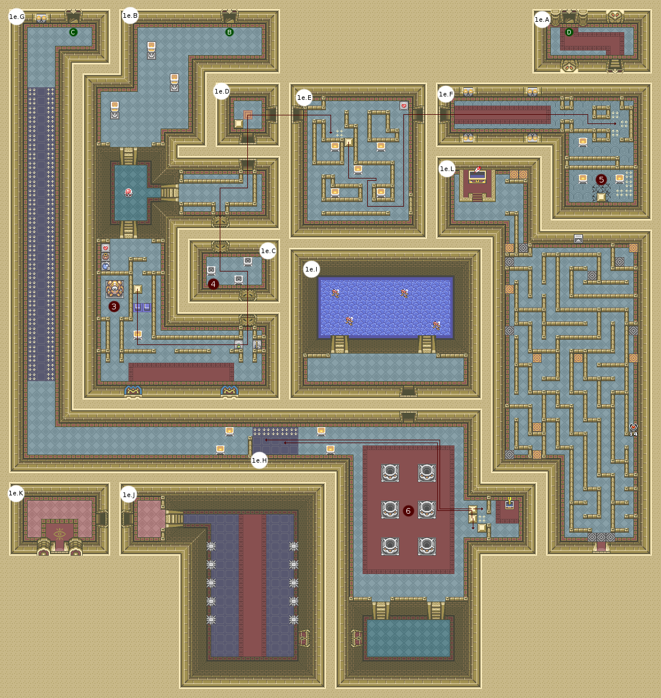
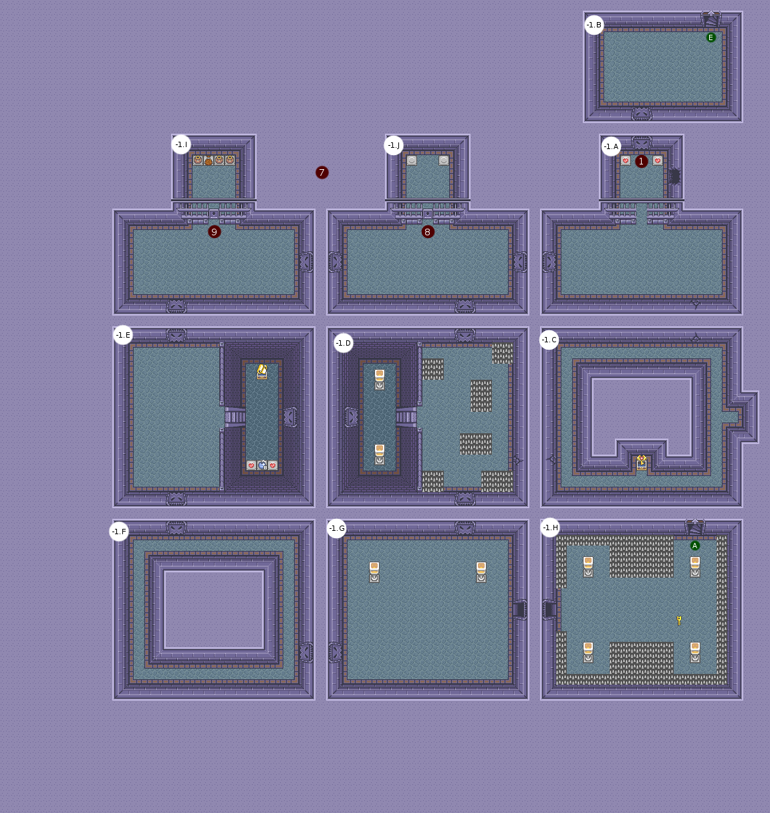

# Chapitre 10 : Château d'Hyrule (Niveau 5)

## Cartes et informations utiles

| Etage | Carte |
|:--:|--|
| Etage 1 |  |
| RDC |  |
| Sous-sol 1 |  |

| Salle | Ennemis |
|:-----:|:--------|
| -1.A | Chevalier Bleu (x1) |
| -1.B | Chevalier Vert (x2) |
| -1.C | Chevalier Noir (x2) |
| -1.D | Chevalier Rouge (x1) |
| -1.E | Chevalier Noir (x2) |
| -1.F | Chevalier Noir (x1) |
| -1.G | Chevalier Noir (x1) |
| -1.H | Chevalier Bleu (x1), Chevalier Vert (x1) |
| RC.A | Chevalier Rouge (x1) |
| RC.B | Chevalier Vert (x2) |
| RC.C | Chevalier Bleu (x1) |
| RC.D | Chevalier Bleu (x2), Chevalier Rouge (x1) |
| RC.E | Chevalier Vert (x1) |
| RC.F | Chevalier Noir (x1) |
| 1e.B | Chevalier Noir (x3), Chevalier Bleu (x1) |
| 1e.E | Chevalier Vert (x1) |
| 1e.F | Chevalier Rouge (x1) |
| 1e.G | Chevalier Rouge (x1) |
| 1e.J | Chevalier Vert (x2) |

| N° | Evénements |
|:--:|:-----------|
| 1 | Ouverte uniquement quand porte principale fermée |
| 2 | Allumer les torches pour ouvrir la porte à l'est |
| 3 | Tirer une flèche dans l'œil de la statue ouvre la porte |
| 4 | Allumer les torches pour ouvrir la porte |
| 5 | Poser une bombe sur les flèches |
| 6 | Faire le tour des pots dans le sens anti-horaire |
| 7 | Portes entre les salles ouvertes aléatoirement |
| 8 | Fausse serrure |
| 9 | Clé de Fer requise |

## Solution

Ce donjon est un peu spécial, car il demande quelques phases d'infiltrations (ce qui n'est pas nécessairement facile lorsqu'on est un bourrin comme Link plus occupé à tondre le jardin que d'aller en cours de stratégie furtive... Heureusement, les gardes ont aussi séché un peu les formations de surveillance, donc ça devrait aller). Si pendant ces phases d'infiltrations, vous êtes repérés, vous atterrissez directement au cachot, vous obligeant à vous retaper tout le chemin que vous aviez fait, en plus de devoir trouver un chemin pour sortir du cachot de prime abord. Je vais donc vous expliquer ici le détail du cachot, comme ça on en est débarrassé. Tout d'abord, la porte de votre cellule cède lorsque vous l'examinez un peu trop (la première fois, les fois suivantes elle cède de suite). Ensuite, les portes reliant les diverses salles du premier sous-sol sont aléatoirement ouvertes, ce qui fait que le chemin pour vous échapper n'est potentiellement jamais le même (bien qu'il n'y ait pas tant de variantes que ça). Il y a la **Carte** du donjon dans la salle au sud de la cellule de gauche, il suffit de descendre les escaliers derrière les gardes pour l'atteindre. Le plus difficile reste la dernière salle (obligatoire) pour sortir, car elle contient deux gardes noirs (les fameux gardes qui arrêtent au lieu de taper) qui se croisent... Il faut choisir un des gardes et le suivre au plus près possible pour atteindre la sortie nord. Un peu d'entraînement et ça devrait passer. Notez que c'est dans cette salle qu'apparaîtra le coffre contenant la Clé du Maître du Donjon, mais j'y reviendrai.

Commençons par le commencement. Le coffre à l'entrée vous donne **100 Rubis**. A droite se trouve un coffre avec la **Boussole**. Descendez d'un étage et tuez les gardes. Le bleu possède une **Petite Clé**. Retournez à l'entrée en tuant le garde bleu à l'étage pour ouvrir la porte, et prenez à gauche de l'entrée. Ouvrez la porte, tuez les gardes et allumez les torches. Prenez l'escalier au nord dans la grande salle avec les torches, et montez d'un étage. Voici LE passage relou de ce donjon. A l'aller ça ira, mais le retour sera bien plus complexe, plus à cause d'un manque de repère qu'autre chose. Dès que vous êtes dans la salle, allez immédiatement vous coller dans le coin supérieur gauche de celle-ci. C'est un des rares points vraiment sécurisé. Vous allez devoir faire une sorte de S, en passant derrière par la gauche de la première torche, rester collé à cette torche et vous décaler jusqu'au mur de droite lorsque le garde est en train de descendre, puis aller rapidement vers le sud et enfin sortir par la gauche. Une fois dans la salle de l'interrupteur de cristal en contre-bas, vous êtes saufs. Pour l'instant.

L'interrupteur de cristal doit être bleu. Prenez l'escalier sud, tuez le garde, tirez une flèche dans l'œil de la statue, et poussez le bloc tout en bas, vers la droite, en bas, à droite contre la seconde jarre (libérez le passage en brisant la première), vers le haut jusqu'à la torche, à gauche, faites une pause en allumant toutes les torches pour ouvrir le passage, et remontez le bloc le plus au nord possible. Activez l'interrupteur de cristal pour qu'il soit rouge, poussez le bloc à droite, puis vers le haut pour le positionner sur le plot orange, et poussez-le à droite pour qu'il soit un cran avant les flèches (attention, ne le poussez pas jusqu'au bout ou vous devrez redescendre d'un étage et revenir pour tout recommencer...). Faites le tour de la salle par le bas, puis poussez enfin le bloc vers le sud pour pouvoir passer par-dessus les flèches sans vous faire déporter. Un nouveau bloc vous attend. Poussez-le tout en bas, puis trois crans vers la droite (pour pouvoir passer derrière depuis la même zone), un cran vers la gauche, tout au sud, à droite, vers le nord jusqu'au vase, puis à droite, un cran vers le bas et pour finir tout à droite. Collez-vous au muret juste au-dessus des flèches au sud de la salle, et posez une bombe. Elle se verra déportée, et fera tomber le bloc un étage plus bas. Vous pouvez maintenant repartir.

Pour repartir sans vous faire attraper par le garde, la clé est la rapidité et la précision. Cachez-vous derrière la torche au sud ou au coin sud-est le plus proche de l'escalier au ras de la ronde du garde, et dès que le garde vous a dépassé en allant vers le nord, mettez-vous en marche. Le chemin est le même, à savoir entre la torche de droite et le mur, remonter jusqu'au coin du mur, aller à gauche et remonter. Vous êtes en sécurité, mais la clé est la vivacité d'exécution. Retournez à l'endroit où vous aviez allumé les torches à côté de l'entrée, entrez par la porte que ça avait ouvert, et lancez votre boomerang contre l'interrupteur de cristal (si vous n'y avez pas directement accès) pour débloquer l'accès à la petite salle du dessus. Activez l'interrupteur de cristal qui s'y trouve, et posez une bombe sur l'interrupteur de cristal rouge pour qu'il devienne bleu une fois que vous aurez dépassé les deux rangées de plots oranges. Vous avez le temps, ne stressez pas avec les Bottes de Pégase. Attention ici, car il y a un autre garde noir... Longez d'abord le mur sud en détruisant les vases (normal que ça ne fasse pas réagir le garde), puis le mur est. Dans la mini-salle au nord, vous pouvez utiliser le grappin pour récupérer la **Grande Clé** dans le coffre. Retournez dans la salle avec le garde noir (n'importe quelle flèche vous y amène, la plus rapide est celle de droite), et allez directement à l'ouest. Vous êtes à nouveau dans la petite salle avec les deux interrupteurs de cristal. Petit raccourci vous évitant des risques, mettez-vous dos aux piques et foncez dans le mur à côté de la porte. Le rebond vous fait aller du bon côté.

Continuez vers l'ouest puis vers le nord par la porte ayant la Grande Serrure. Montez d'un étage, suivez le couloir jusqu'à arriver dans la salle avec le tapis rouge et les six pots géants. Ici, commencez par longer les pots par la gauche, continuez à faire le tour par le bas, puis remontez par la droite pour enfin revenir à votre point de départ, tout ça sans jamais passer au centre des pots (sinon il faut recommencer). Vous débloquez le coffre caché du sous-sol. Le problème, c'est que vous ne pouvez pas retourner en arrière (sauf par un save + quit, mais vous devrez de toute manière faire ce passage pour obtenir l'équipement de ce donjon). A droite de cette salle se trouve un coffre. Utilisez l'habituel mouvement (celui du haut à droite et celui du milieu vers le bas) pour y accéder. Grâce à cette **Petite Clé**, ouvrez la porte au sud. Dans la salle suivante prenez garde aux piques, ils s'entrechoqueront à votre passage. Utilisez les Bottes de Pégase depuis le tapis rouge pour passer sans danger. Suivez le seul chemin disponible passant par balcon extérieur. Ici, prenez le téléporteur du chemin nord, puis partez sur la gauche pour atteindre le seul téléporteur disponible (vous pouvez aussi y accéder depuis le téléporteur du couloir de droite à l'entrée, c'est le plus proche de vous dans ce cas), vous devriez être dans le petit carré en haut à droite de la salle, un seul téléporteur est accessible, puis prenez le chemin du bas pour atteindre l'avant dernier téléporteur. Vous n'avez pas le choix sur le dernier, et vous êtes désormais devant le Grand Coffre. Grâce à la **Plume**, sautez dans le téléporteur le plus à droite, puis par-dessus le téléporteur au sud (ou utilisez le Boomerang) pour atteindre le **Fragment de Cœur #14**. Prenez ce téléporteur et vous êtes à l'entrée du labyrinthe. Vous pouvez désormais rebrousser chemin.

Une fois dans la salle aux grands pots, faites glisser les blocs vers la gauche (contre le pot central), puis vers le nord et ensuite vers la gauche (en vous assurant d'avoir laissé une place pour vous glisser entre le mur nord et le bloc). Utilisez la torche de droite pour mieux caler le bloc, et mettez un premier bloc contre la seconde flèche, et le second bloc contre la quatrième flèche. Vous pouvez désormais sauter vers la gauche, en vous servant des blocs pour ne pas être déporté. Le plus simple maintenant est de se faire arrêter, ça vous permettra d'explorer plus facilement le sous-sol. Comme je l'indiquais en introduction, ici il faudra vous débrouiller pour trouver votre chemin vers la sortie. La salle où les deux gardes noirs se croisent est la salle où se trouve la **Clé du Maître**. Pour la récupérer, vous devez suivre le garde du bas allant vers la droite dès qu'ils se sont croisés. Récupérez la clé, et retournez dans le mur fissuré. Attendez qu'ils repassent, et cette fois-ci suivez-le jusqu'à l'abri à droite de la salle. Une fois que celui venant en contresens vous a dépassé, continuez vers le nord et sortez pour reprendre l'entrée principale du château. Une grande rapidité peut vous permettre d'aller directement de la fissure vers le nord et vers la sortie avant que le garde venant à contresens vous repère. Retournez dans la salle avec les deux interrupteurs de cristal, cette fois-ci vous pouvez couper grâce à la **Plume** pour aller directement à droite. Ouvrez la porte du Maître, et montez les étages jusqu'à arriver sur le toit du château.

## BOSS : AGAHNIM

Ce bon vieil Agahnim. Sa tactique reste la même que tous les affrontements précédents. Il va vous envoyer dans un premier temps des boules de feu, jouez au tennis avec lui jusqu'à ce qu'il se la prenne. Parfois, il va corser le jeu en rajoutant des boules explosives (elles sont bleues au lieu d'être rouges), puis ensuite il va en envoyer trois d'affilées. A chaque rebond de ses projectiles, leur rapidité augmente, continuez à les lui renvoyer jusqu'à ce qu'il abandonne le combat. Deux fées ne seront pas de trop pour vous aider, d'autant que la restauration automatique des cœurs peut aider en évitant d'avoir à songer à se soigner. Il s'énerve au bout de cinq boules de feu renvoyées dans sa tête, et il vous faudra lui renvoyer en tout dix fois ses sorts. Il faut être placé à peu près au centre du T pour faire des renvois efficaces, en particulier au plus proche de lui et bourriner les coups d'épée lorsque les boules sont au nombre de 3 (sinon, rester avec juste l'épée dégainée en face d'Agahnim fonctionne). Pour les boules bleues, éloignez-vous au maximum de lui tout en restant bien en ligne de droite par rapport à sa visée. Les boules rebondissent de façon symétrique, et le moins vous aurez de boules partant n'importe comment, mieux vous vous porterez. Les boules disparaissent au bout d'un certain nombre de rebonds, d'où l'importance d'être éloigné (pour qu'elles aillent toutes dans la même direction avant que vous les esquiviez) et de le faire en ligne droite. Bon courage.

Une fois vaincu, vous pouvez récupérer le **Receptacle de Cœur** et continuer votre périple. Attention, si vous quittez le jeu ici, la prochaine sauvegarde vous fera réapparaître sur le toit : entrez et ressortez du donjon avant de sauvegarder pour bien initialiser votre point de retour.