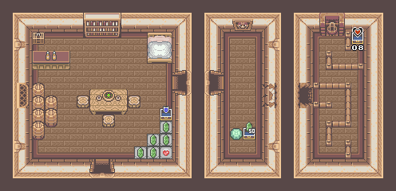
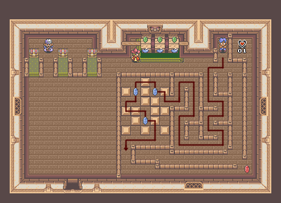
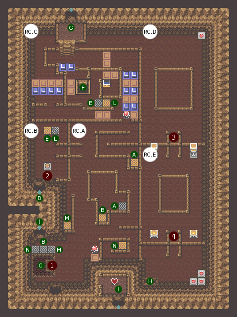
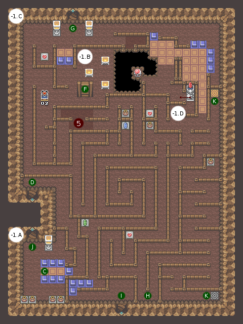

# Chapter 1: THE AWAKENING OF THE HERO

## Preparations

After the introduction, jump from your bed and open the chest containing your **Shield**, and take the opportunity to break all the vases: **5 rupees** will be granted in all. Do not worry about the room on the right, you can only go a little later. Get out of the house, and talk to the monkey to let you pass.

Head north, following the cliff on the right. You see a ledge from which you can jump, with leaves crossing the barrier diagonally. Jump then. In the chest there are **50 rupees**. Take them now, they will be needed, then go to the cave on the left.

The chest visible at the entrance is empty. In the second room, there is a crystal switch (do not touch with the vases, it is useless). Under the vase at the top left is **5 rupees**, and the one on the right **1 ruby**. Continue on the right, and activate the switch with a vase. The rest is linear. When you arrive at the trapped ground that is deporting you, take the bottom spoiler. You arrive on the other side. Climb the stairs, and take the **3 blue rupees**. Retrace your steps, and head north. Buy the **Sword** for 75 rupees (you should have 76 if you followed the steps in this guide). You are now armed to continue the adventure.

Get out of the forge (taking the stairs and dropping from the platform to the entrance, it will be faster). Head south without forgetting to destroy all the bushes in your path. If you want to cut bushes quickly, face the bush line, and stay on the sword as you move forward. This avoids firing several swords for a straight line. Continue to go south, passing in the alley between the trees. You have a chest to the west with **20 rupees**, as well as rupees hidden behind the trees next door. Take them, and you should be around 50 rupees. Go back to the village, and if you do not have the 50 rupees, cut some bushes, kill some soldiers, and go back and forth to your house to lift the vases until you have them.

The house on the left of Link's (as a reminder, Link's has a barrier) is the store. Inside, you will find **3 apples** for 25 rupees. Buy two (so 6 apples for 50 rupees). Do not eat them, and go to the pastry shop, south of Link's house. Exit as soon as you enter. The pastry chef asks you to contribute to his apple pie by bringing him 6 apples: ideal, you have them! He gives you your first **Bottle**. You must fill it, either in the fountain of the village, or in the trough in front of the pastry shop (nearer). Now go to Sahasrahla and talk to him. His house is on the same screen as Link's, south-west of the store, surrounded by grass and a thick low wall. After explaining the situation, he gives you the **World Map** and authorizes you to visit his cellar.

Go down and follow the only path that presents itself to you. Cross the two rooms. You arrive in the cold room. Use on the frozen door the water that you have recovered. It is released and allows you to recover the **Key of Earth**. You can now visit the cellar of the village. Get out of the ancestor's house and head east after picking up the fairy in the grass north of his house (and storing it in your new bottle). This will be a considerable advantage for the future.

If you have enough rupees, stop at the *Ruby House* (a sign showing which house it is) to collect a Piece of Heart. It's the game on the far right. Find the right way to go before talking to the character, and get to the end of the road. For information, the right path is the one on the left. Once the mini maze has passed, the countdown stops and you have plenty of time to push the blocks (there is only one way to do it) and recover the money as well as the **Piece of Heart #01**.

## Lyriann Cave

TODO: translate maps, enemies and events.

| Floor | Map |
|:--:|--|
| RDC |  |
| Sous-sol 1 |  |

| Room | Enemies |
|:-----:|:--------|
| -1.C  | Soldat (x1) |
| -1.D  | Popo (x3) |
| RC.A  | Popo (x1) |
| RC.B  | Popo (x1) |
| RC.D  | Popo (x4), Tetdoss (x1) |
| RC.E  | Popo (x4), Tetdoss (x2) |

| # | Event |
|:--:|:-----------|
| 1 | Sauter depuis l'excroissance |
| 2 | Ouvre le raccourci à droite |
| 3 | Tuer tous les Popos pour ouvrir le passage |
| 4 | Tuer tous les Popos pour ouvrir le passage |
| 5 | Marcher uniquement sur la partie sud du sol |

Next to the old fountain is the entrance to the Lyriann Cave. Go ahead and use the Key of Earth. Take the teleporter north east of Tom and talk to him. After having made a topo, he challenges you to recover the treasure of this cave. To do this, he lends you his **Boomerang**. Take the teleporter and you are again in front of the entrance. Turn on the crystal switch, and jump into the hole from the slight outgrowth that goes ahead. You land on the orange pads. Jump to the right and follow the only path that leads to a staircase leading down to the ground floor. Under the vase is a button activating the exit to the entrance. You will not need to go through the hole to return to the teleporter of this room. Before entering, activate the crystal switch again so that the blue pads are raised. So take the teleporter, and take the stairs (the chest is useless, it is empty). With the Boomerang, turn on the crystal switch and walk up the stairs.

You can now climb on the platform to go down to -1 while being in the northern part. On the right, part of the ground is darker. This is the hint on the next thing to do. You have to throw the boomerang in the direction of the crystal switch and immediately stick to the right so that at the return he activates it. Go back to the ground floor, then go to the right in front of the first plot that you come across. You can activate the crystal switch with your boomerang, it passes through the studs. Activate it constantly while advancing to finally find yourself next to it. Do not go in the teleporter, it will take you back to the entrance and you will have to do it again!

Once next to the crystal switch, lower the orange studs, move on, then lower the bruises. Now you have to launch the boomerang and rush north before it reaches the teleporter to be on the blue pads before they go back up. Namely that during the animation where Link launches the Boomerang, you can already press up, it will not change direction before the boomerang is launched.

You can now go under the platform leading to the lower floor. Beware of Bubble (an invincible enemy that will kill you), and kill all enemies. It will have to be done in each room to be able to advance. In the second room, the Bubbles are always going in the same direction, let them go and follow them at a respectable distance. If you find yourself in bad shape, hide yourself near a torch, as far as possible from the center of the room, and be ready to welcome the Popos in case (the Bubbles should not be able to reach you). The vases in the last room contain hearts as needed. Jump in the hole.

You end up in a mini labyrinth. Take the left towards the pot, go straight to meet a cross where there are four pots: take to the left to pass between these four pots. Before the ground becomes dark, go south: the north is trapped and will prevent you from passing. You can recover **Piece of Heart #02**. Return to the crossing with the four pots, and this time take a right. Do not take the teleporter and go instead to the orange studs. Follow the wall on the left to the statue and pull it a notch. Take the opportunity to activate the crystal switch. You can do it either diagonally from the orange studs, or face it and quickly go north to climb the orange studs as they are down. Rewind way to retrieve the chest: it contains **20 rupees**.

From the junction of the four jars, go south then west straight. Another landmark is from the first pot that you came across when you fell: from there, always walk along the wall on your left. You arrive at a spiraling passage (square indeed, but a spiral), and continue on the only path available. You arrive at the last staircase leading to the **Heart Container**. Exit by jumping to the left, Tom automatically retrieves his boomerang. He promises to give you a hand when you are in need.

If you did not have enough to recover Piece of Heart #01, you should be able to get it now. The dungeon awaits you to the west from where you opened the chest with 20 rupees and recovered the rupees hidden behind the trees, southwest of the village. Tom will take you down a ladder when you are in front of the first dungeon.