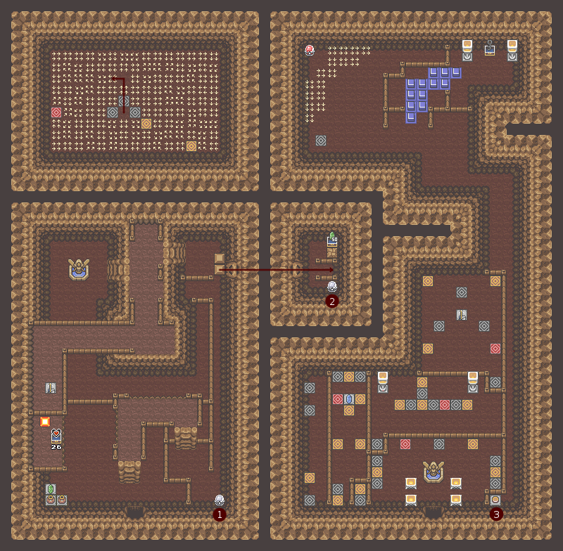
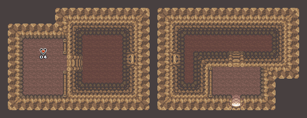

# Chapter 3: The Twin Caves

## Maps and Events

| Floor | Map |
|:--:|--|
| The Twin Caves |  |
| Sahasrahla's Basement |  |
| Hole and Flower Cave |  |

| # | Event |
|:--:|:-----------|
| 1 | Open door leading to the second crystal switch |
| 2 | Remove the statue near the second entrance |
| 3 | Open a shortcut to the exit |

## To the Roc's Cavern

Return to the *Basement at Sahasrahla's House* and lift the jars and the stone to access the **Bow**. You miss the arrows, but you will find them in the bushes, the jars or by killing enemies. Get out, and go east by raising the stone and fall into the hole between the two caves. You are in the *Cave of the Flowered Hole*, and you can catch the **Piece of Heart #04**. So you should have a new complete heart. Exit on the right, and go back to the entrance of the first dungeon.

To the south you will find a stone maze and two caves. Jump first from the ledge to the east entrance of these twin caves. In this room, go to the crystal switch on the right. Go back on the platform and jump north. Do not worry about the chest to the west, you can only have it much later in the game (it contains **Piece of Heart #26**). Bypass the platform to the left and continue straight to access the blocks on the right. Push the bottom one to the end of the path to free the passage to the second crystal switch. Once again, the chest of this room will only be accessible later, when you have the bombs: it contains **50 rupees**.

Exit the cavern and this time, enter the east entrance of the twin caves (for that you need to make your way through the stones, but the labyrinth is quite simple: go to the black stone, take the path opposite and after the stone you have raised, walk along the left fence). This is a teleport maze as you will encounter a lot in the game. On the map, the teleporters to take are of a different color. In the entrance, take the one to the northwest, then the one to the left of the jar, the second from the right, take the contents of the jar (it contains arrows), then enter the teleporter below to the right.

You are now in the maze of treadmills. The right path is up, then to the left. So let yourself be carried to the last teleporter (the one on the left) that brings you to the last room. This is where you need the bow and arrows: to activate the crystal switch protected by treadmills. You thus get the **Roc's Key**. You can come out of the twin caves along the corridor to the south. The button opens the gateway to the exit.

Return to the village (avoid lifting too many stones for now, their loot will be more useful later ...) always staying at the top of the labyrinth: it is the most simple and fast exit. Go back to the puddle next to the blacksmith's house, where you jumped at an angle (following the leaves) for the first time. To the north is a closed door, which is the entrance to the second dungeon. Engulf yourself in the next adventure!
